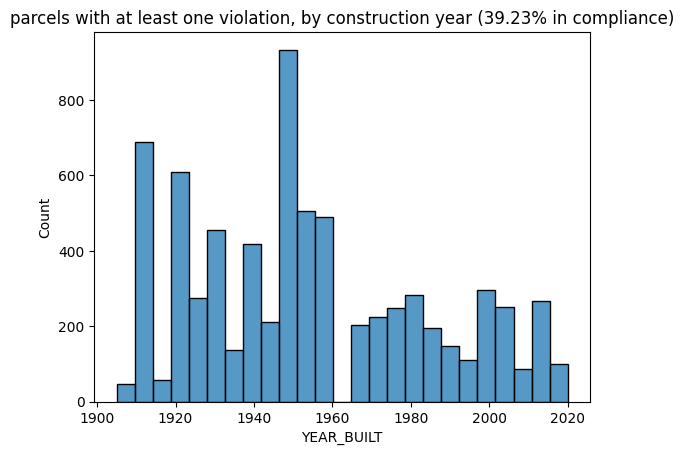

# Waltham's neighborhood character is disrespected - by NIMBYism

Whenever housing is proposed, the inevitable pushback from the oppposition comes with concerns that it will change the character of the community.
I'm here to tell you that the character of the community has been changed before, by the anti-housing side, and you are _probably_ living in a home that is illegal to rebuild
today. **This is raising your cost of living**.

## What's wrong?

Over the course of decades, Waltham has tightend zoning restrictions on residential housing by requiring larger minimum lot sizes, limiting the height (and/or number of stories) of buildings, lowering
Floor Area Ratios (FAR) to reduce building massing, limiting the built up area (this is similar to FAR), adding setbacks to buildings, adding minimum parking mandates, and limiting the number of dwelling
units per area.

Using maps available from MassGIS and our zoning code, I have done an [analysis](https://github.com/tjrileywisc/waltham_gis/blob/main/investigations/illegal_zoning/illegal_zoning.ipynb) of _some_ of the restrictions applied to residentially zoned parcels in Waltham.

The biggest one - lot size smaller than zone's minimum (52% compliant)

Lot coverage is too high (80% compliant)

Density too high, or residence type is forbidden (87% compliant)

Building is too tall (98% compliant)

FAR is too high (90% compliant)

Totally, ~39% of parcels are compliant. If you check against units though (i.e. the number of units in compliant parcels), it's **only 28%**.

## NIMBYs don't even respect the character of their own city

If one was truly concerned about the character of their city, they wouldn't cause such a large percentage of their existing structures to be non-replacable. The whole goal of community
preservation is supposedly to only allow more of the same structures to be built. That's clearly impossible in much of the city with these zoning rules,
and to build by-right (that is, according to current zoning), one would have to merge parcels. The economics of that would lead to a lot of million-dollar homes for the upper-middle and upper classes. Is that the character of Waltham that we're shooting for?

This isn't a problem unique to us, by any means. Somerville found out a few years ago that their city was [also illegal](https://cityobservatory.org/the-illegal-city-of-somerville/), and the New York Times put up an interactive [data visualization](https://www.nytimes.com/interactive/2016/05/18/upshot/which-buildings-in-manhattan-couldnt-be-built-again-today.html) showing several reasons why much of
Manhattan is also illegal (they also have NIMBYism, believe it or not). Many communities responded to the MBTA Communities act by selecting lots where multifamily housing already exists, which wouldn't have been possible if the lots hadn't been downzoned in the first place.

## What's the result?

It is _possible_ for housing to get built with our restrictions, even though it would be non-conforming if it is even close to affordable (my own home is in a lot that is too small, and built after that restriction was applied). A developer wanting to build in this way has to go to the Zoning Board of Appeals to get approval. It can take time, and might require a hiring a lawyer to make your case. This acts to discourage or raise the cost of development.

A far more socially negative impact comes from the fact that this sort of zoning is effectively **economic segregation**. By adding restrictions to build envelopes and lot sizes, we're raising the cost of housing and pricing out folks with lower incomes.

## How did this happen?

Clearly we have a situation here where much of the older housing stock is 'too dense' per the current zoning. The situation we have now is a downzoning from that original state. I believe actually
that this is a violation of the 5th amendment's takings clause because it is an uncompensated taking of property value from landowners.
(and I'm not the only one who [thinks this way](https://www.theatlantic.com/ideas/archive/2024/06/constitutional-case-against-exclusionary-zoning/678659/)).

Per my understanding, this is allowed due to a case called Euclid v. Ambler, way back in 1926. The upshot of that case is that Ambler Realty wanted to develop
apartment buildings, and the city of Euclid was able to convince the Supreme Court that it was okay to restrict this by following an exception of the takings clause referred to as 'police powers'. Basically, a government doesn't have to compensate for a taking if it's for public safety. For this argument to be valid, one would have to believe that the people living in apartments were a form of pollution (one of the judges called apartments 'parasitic').

## If you think this is fine, actually

I have to caution you against thinking that it's even possible to preserve the character of a community. As shown above, it's changed before. The city has made a choice to invite a lot of
commercial development and jobs to the city, but not allow the housing to match. This creates demand to live in the city, and these workers are generally well paid. They'll outbid the kids of
long time residents and elderly people trying to downsize if housing isn't made available to meet this demand. You also won't likely have much luck trying to convince the city that we should allow less commercial development, since it would mean residents would bear more of the tax burden.

## The map of violations in Waltham

You can view a map of violations that I've generated for Waltham [here](https://drive.google.com/uc?export=download&id=1WhrWtpJ3YKoxssDta_cS1ur-FVMmeBTV). You'll have to download the .html file and run it in your browser. There's a search tool for the address (which isn't amazing, I'll admit), but you can mouseover parcels to see how they're violating one or more zoning constraints.

## Sources

Much of the data is available on MassGIS, specifically from [the property tax parcels page](https://www.mass.gov/info-details/massgis-data-property-tax-parcels).

The Waltham zoning code I reference can be found [here](https://ecode360.com/27095686#27095686). I mostly rely on the dimensional regulations table, which can be found [here](https://ecode360.com/attachment/WA1697/WA1697-Ze%20Table%20of%20Dimentional%20Regulations.pdf).

If you'd like to know more, I can recommend two recent books:

- Excluded, by Richard Kahlenberg - this one goes into a lot of detail and even compares zoning situations in neighboring communities. You'll never guess how absurdly high Weston's minimum lot size is!
It's probably twice what you think it is!

- Arbitrary Lines, by M. Nolan Gray - an easy read that goes into how thoroughly cooked zoning is generally, and suggests alternatives which can relieve the housing crisis, while promoting fairness and economic growth at the same time.

By the way, I'm doing this analysis [in my github repo](https://github.com/tjrileywisc/waltham_gis) using GIS, SQL, and mostly python. It's open for PRs as well. If you understand any of that,
and are interested in helping to get an accurate view of our city's development situation, please reach out.
